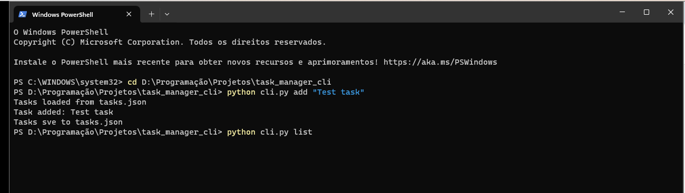

# Task Manager CLI

Professional Command Line Task Manager built with Python.

This project demonstrates:

- argparse CLI interface
- file I/O with JSON
- object oriented programming
- persistent data storage
- clean project structure

---

## Features

- Add tasks
- Remove tasks
- Complete tasks
- Persistent IDs
- JSON storage
- CLI tool

---

## Commands

Add task

python cli.py add "Title" -d "Description"

List tasks

python cli.py list

Complete task

python cli.py complete 1

Remove task

python cli.py remove 1

---

## Example

---

## Tech

- Python
- argparse
- JSON
- CLI
- OOP